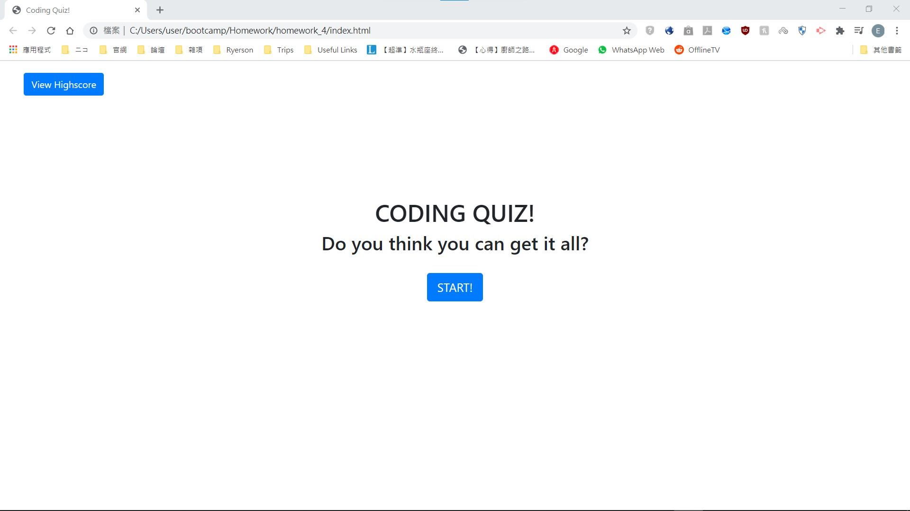
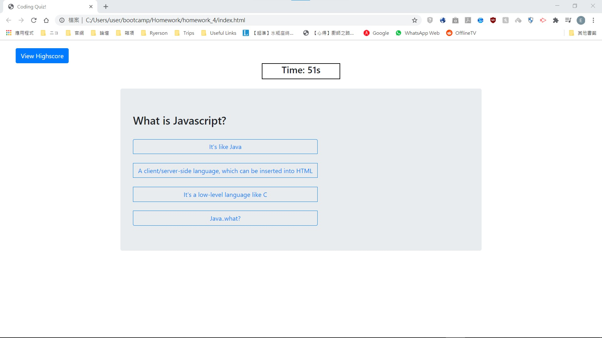
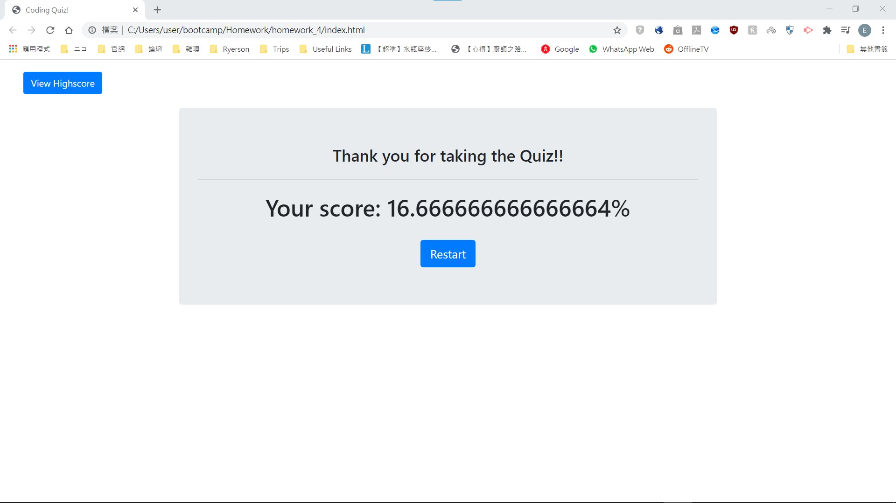
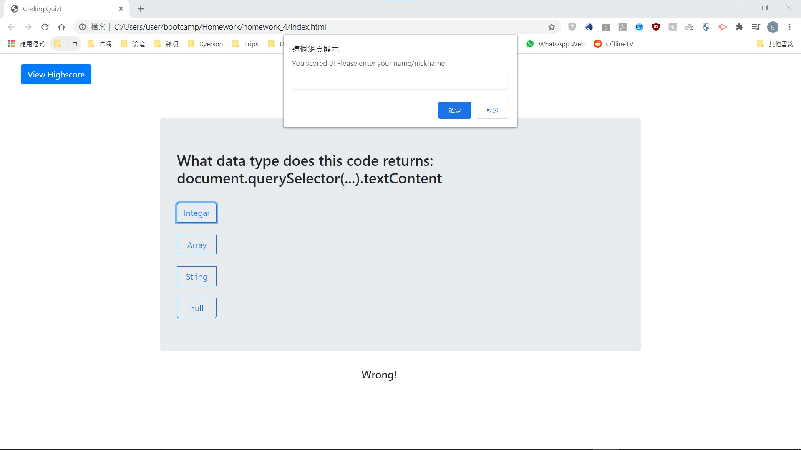
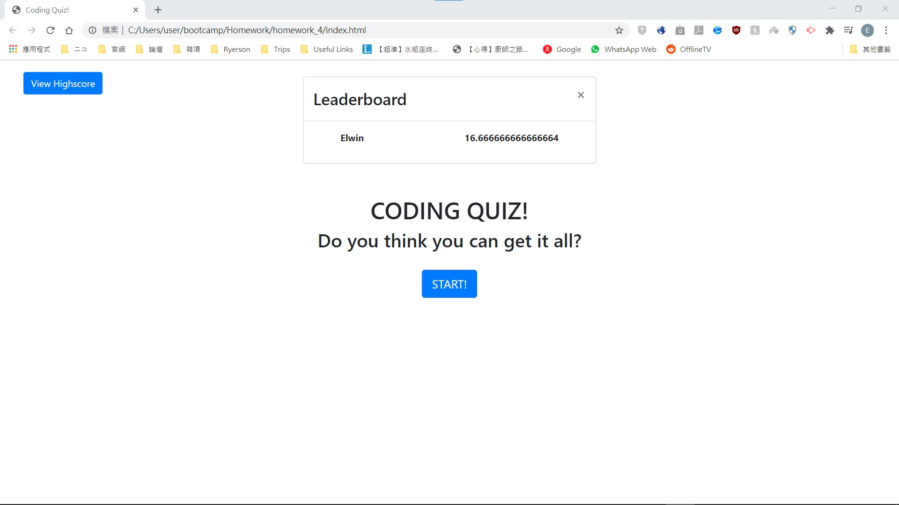
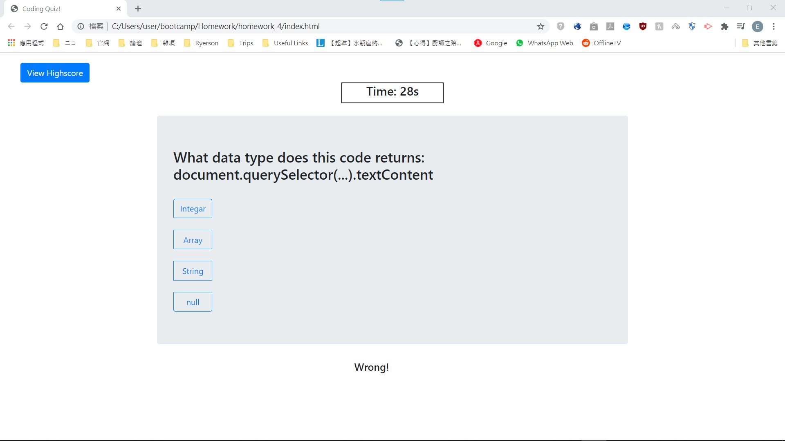

# Timed-Quiz
Goal: To create a timed-quiz with javascript and one html file. 
This project has the following abilities:
- User is able to start and restart the quiz
- After making a choice, a new set of question and answers will be inserted
- Able to check if player made a new highscore and display that when "View Highscore" is pressed

## Notes:
- Highscore is refreshed every time the page is reloaded
- localStorage is not used in the current build

 

This project contains the folloing:
- index.html: Contains Landing page, Quiz page and Game-ended page all in one.
- script.js: Uses javascript to control which HTML element is displayed on screen as well as manage the quiz.
- style.css: General styling for index.html.

 

This project was made using **HTML5**, **Bootstrap**, **Javascript** and **CSS**. 
This project is currently hosted on Github Pages: https://elwinung0120.github.io/Timed-Quiz/

# index.html
- Contains the following **Bootstrap** elements: Jumbotron, Modal, Buttons
- All elements are controlled through **script.js**

## Landing Page when the page is first loaded or "Restart" is pressed on Game-end Page

## Quiz Page when "Start" is pressed on Landing Page

## Game-end Page when the quiz is finished

## Game ends when the timer runs out

## Shows leaderboard when "View Highscore" is pressed

# script.js
- Made use of DOM to control index.html when button is pressed, e.g. "Start" button starts the quiz; "Restart" button restarts the quiz.
- Only appropriate elements are displayed on screen, e.g. Landing page on first load; Quiz page when "Start" is pressed
- Automatically switch to next question after an answer was selected as well as instant feedback as **Correct/Wrong**

## Feedback is provided below the quiz block

# style.css
- General styling for index.html
- Has display: none for all the HTML elements
